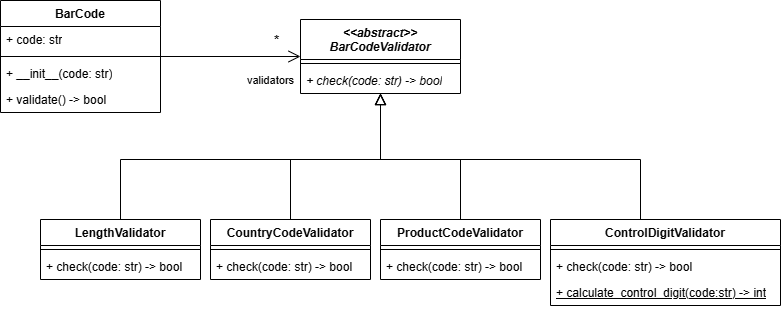

# Ejercicio Validador Código de Barras

Para este ejercicio vas a suponer que trabajas en un proyecto donde te asignan la tarea de desarrollar un módulo para 
la validación de códigos de barras.

En el diseño del módulo para validación de códigos de barras se establecieron cuatro reglas de validación, las cuales 
fueron:

### A. Validación de la longitud
Esta regla verifica si un código de barras tiene una longitud de 16 caracteres.

### B. Validación del código del país
Esta regla verifica si los primeros 3 caracteres del código de barras son letras.

### C. Validación del código del producto
Esta regla verifica si los últimos 13 caracteres del código de barras son números.

### D. Validación del dígito de control
Esta regla verifica si el último dígito del código de barras es un dígito de control válido. El dígito de control
es el último dígito del código de barras y se calcula de la siguiente manera:

1. Se suman los dígitos de las posiciones impares de los 12 caracteres del código de barras que están después del
código del país. El resultado se multiplica por 3.
2. Se suman los dígitos de las posiciones pares de los 12 caracteres del código de barras que están después del
código del país.
3. Se suman los resultados de los dos pasos anteriores.
4. El dígito de control es el número más pequeño que se debe sumar al valor obtenido en el paso 3 para que el resultado 
sea un número divisible por 10.

Las reglas de validación se verifican una por una y en el orden en el que aparecen en la descripción. Esto quiere decir
que si una condición no se cumple, no se verifican las siguientes.

Con base en los requisitos del problema, el arquitecto de software del proyecto realizó el siguiente diseño para el 
módulo de validación de códigos de barras:



Tu misión es implementar el modelo planteado por el arquitecto de software. Para lograr tu misión debes tener en cuenta
lo siguiente:


### Clase `BarCodeValidator`
* La clase es abstracta.
* El método `check` es abstracto.

### Clase `LengthValidator`
* La clase hereda de `BarCodeValidator`.
* El método `check` recibe un código de barras y retorna `True` si la longitud del código de barras es 16, de lo contrario
retorna `False`.

### Clase `CountryCodeValidator`
* La clase hereda de `BarCodeValidator`.
* El método `check` recibe un código de barras y retorna `True` si los primeros 3 caracteres del código de barras son letras,
de lo contrario retorna `False`.

### Clase `ProductCodeValidator`
* La clase hereda de `BarCodeValidator`.
* El método `check` recibe un código de barras y retorna `True` si los últimos 13 caracteres del código de barras son números,
de lo contrario retorna `False`.

### Clase `ControlDigitValidator`
* La clase hereda de `BarCodeValidator`.
* El método **estático** `calculate_control_digit` recibe un código de barras y retorna el dígito de control calculado. 
* El método `check` recibe un código de barras y retorna `True` si el dígito de control es válido, 
de lo contrario retorna `False`. Para esto, utiliza el método estático `calculate_control_digit`.

### Clase `BarCode`
* La clase recibe un código de barras en el constructor y lo almacena en un atributo de instancia llamado `code`.
* La clase tiene un atributo de instancia llamado `validators` que es una lista que se inicializa con instancias de las 
clases `LengthValidator`, `CountryCodeValidator`, `ProductCodeValidator` y `ControlDigitValidator` en ese orden.
* El método `validate` recorre la lista de validadores y verifica si el código de barras cumple con las reglas de 
validación. Si alguna de las primeras tres reglas de validación no se cumple, el método arroja una excepción de tipo
`InvalidCodeStructureError` con el mensaje `Code <code> has an invalid structure`. 
Si la cuarta regla de validación no se cumple, el método arroja una excepción de tipo `InvalidControlDigitError` con el
mensaje `Code <code> has an invalid control digit`. Si todas las reglas de validación se cumplen, 
el método retorna `True`.


## Ten en cuenta

* El proyecto incluye un conjunto de pruebas que puedes utilizar para verificar el cumplimiento de los 
requisitos establecidos. Para ejecutar las pruebas, debes instalar la dependencia pytest.
    ```bash
    pip install pytest
    ```
* Para que las pruebas funcionen adecuadamente debes implementar el código respetando los nombres y la 
definición de las clases y los métodos que se presentan en el diagrama.
* La evaluación del ejercicio se hará con base en el cumplimiento de los requisitos que arrojen las 
pruebas. Por lo tanto, cualquier fallo en las pruebas debido a nombres mal escritos o que no concuerden
con el modelo dado se considerará como un requisito no cumplido, afectando la calificación del examen.
* Hay 31 pruebas y cada prueba puede tener uno o varios casos de prueba. En total son 56 casos de prueba. La evaluación se
hace con base en las 31 pruebas, por lo que cada prueba tiene un peso de 1 punto. Las pruebas que tienen más de un caso
de prueba, tienen el mismo peso. Por ejemplo, si una prueba tiene 3 casos de prueba, cada caso de prueba tiene un peso
de 0.33 puntos. Igualmente, si una prueba tiene 2 casos de prueba, cada caso de prueba tiene un peso de 0.5 puntos.
